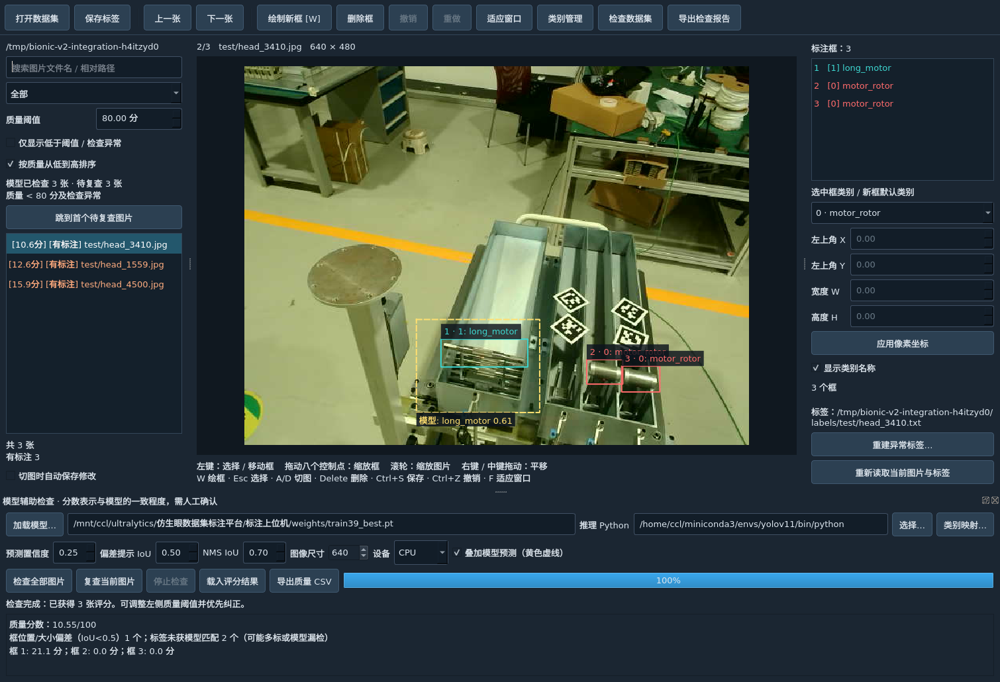
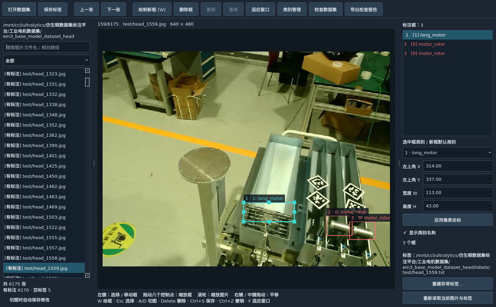
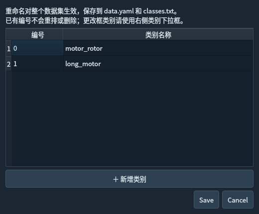
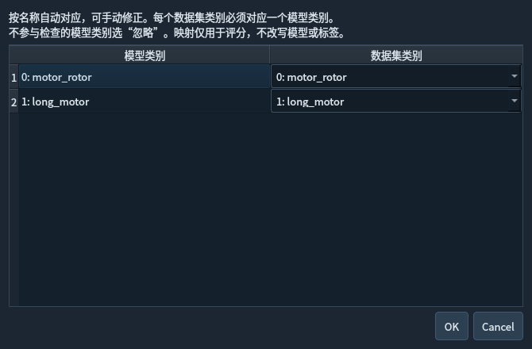

# 仿生眼数据集检查与纠正平台

面向 **YOLO 目标检测数据集** 的中文桌面工具，基于 PyQt5，帮助使用者在训练前检查标签格式、浏览和纠正标注，并借助已训练模型优先定位需要人工复查的图片。

适用于已有检测数据集的标注验收、错标修正和训练前整理。可用于工业电机等目标检测场景；类别由数据集配置读取，不限于截图中的电机类别。编辑结果仍保存为标准 YOLO `.txt` 标签，可继续用于训练。

**基本流程：打开数据集 → 扫描标签 → 人工检查 / 模型辅助筛选 → 修改并保存 → 导出报告。**

## 平台能做什么

| 功能 | 具体能力 | 版本 |
|---|---|---|
| 数据集浏览 | 同时浏览 train / val / test 图片；按文件名、相对路径和标签状态筛选；支持图片缩放、平移和适应窗口 | V1 / V2 |
| 可视化标注编辑 | 新增、删除、拖动和缩放检测框；通过原图像素坐标精确调整位置和尺寸；修改单框类别；撤销与重做 | V1 / V2 |
| 类别管理 | 从 YAML 或 `classes.txt` 读取类别，重命名或追加类别，保持已有类别编号不变 | V1 / V2 |
| 标签格式检查 | 检查五列检测格式、类别编号、有限坐标、正宽高和框边界；区分空标签、缺失标签和格式异常 | V1 / V2 |
| 异常处理 | 显示标签错误文件及行号；支持重新读取和经确认后重建异常标签；图片无法解码时禁止保存标签 | V1 / V2 |
| 保存与备份 | 覆盖前自动备份，使用原子写入；发现标签被其他程序修改时拒绝覆盖；可开启切图自动保存 | V1 / V2 |
| 标签检查报告 | 导出 CSV，包含图片路径、标签路径、检查状态和详情 | V1 / V2 |
| 模型辅助检查 | 加载已训练的 Ultralytics YOLO 检测 `.pt` 模型，比对预测和已有标签；支持 CPU / GPU 0 | V2 |
| 类别映射 | 按名称自动匹配模型与数据集类别，也可手动指定；多余的模型类别可忽略 | V2 |
| 质量评分与复查 | 显示图片和单框得分，提示疑似类别不一致、框偏移、漏标或多标；按分数排序、按阈值筛选并跳转复查 | V2 |
| 预测叠加 | 彩色实线显示原标签，黄色虚线显示模型预测及置信度，可切换预测显示 | V2 |
| 评分更新与保存 | 保存标签后利用缓存预测重新评分；支持重新推理当前图片、停止检查、保存和载入评分结果 | V2 |
| 模型质量报告 | 导出按低分排序的 CSV，包含质量分数、待复查状态、疑似问题、单框得分和模型参数 | V2 |

V1 适合纯人工检查，不需要模型。V2 包含上述人工编辑功能，并增加模型辅助复查；不加载模型也能使用基础编辑功能。根目录 `app.py` 默认启动 V2。

## 界面与功能预览


### V2 · 模型辅助质量检查

结合模型预测与人工标注，查看质量分数、筛选低分图片，并用黄色虚线叠加预测框。下图为现有模型检查示例，分数用于辅助复查。



### V1 · 人工检查与标注编辑

浏览数据集，选择、移动或缩放标注框，并在右侧精确调整类别和像素坐标。



### 类别管理

在真实应用对话框中查看类别编号、重命名类别或新增类别；已有编号保持不变。下图使用示例类别展示界面。



### 模型与数据集类别映射

模型类别与数据集类别可以手动对应，不参与检查的模型类别可选择忽略。下图使用示例类别展示一对一映射。



## 安装与启动

需要 **Python 3.10 或以上**及图形桌面环境。界面依赖为 PyQt5、PyYAML 和 Pillow。已有 Linux 环境验证；提供 Windows 启动脚本，但 Windows 平台尚未实测。普通无显示的 SSH 会话无法直接展示窗口。

```bash
git clone https://github.com/cLin-c/bionic-eye-dataset-checker.git
cd bionic-eye-dataset-checker
python -m pip install -r requirements.txt
python app.py --dataset "/你的数据集目录"
```

也可将 `--dataset` 指向数据集的 `data.yaml`。不传参数时，若程序预设的本机 head 数据集存在则自动打开，否则在界面点击“打开数据集”选择。**仓库不包含训练数据集或模型权重，需要自行准备。**

| 启动版本 | Linux | Windows |
|---|---|---|
| V1 人工检查 | `./启动V1.sh` | `启动V1.bat` |
| V2 模型辅助检查 | `./启动V2.sh` | `启动V2.bat` |

Linux 脚本默认使用 `python3`，可通过 `DATASET_EDITOR_PYTHON` 指定界面解释器。根目录的 `启动数据集检查.sh` / `.bat` 也默认启动 V2。

### 可选：安装模型推理依赖

仅人工编辑时不需要安装模型依赖。使用 V2 模型检查时，在选定的推理环境执行：

```bash
python -m pip install -r V2/requirements-model.txt
```

界面与推理可以使用不同 Python 环境。在 V2 的“推理 Python”栏选择已安装 `torch`、`ultralytics` 等依赖的解释器；程序优先尝试原开发环境路径，不存在时回退到当前解释器，在新机器上请核对该设置。模型包含自定义层或依赖特定训练版本时，应使用与其兼容的推理环境。

## 数据集格式

推荐目录结构如下，图片与标签的相对路径和文件主名应一致：

```text
dataset/
├── data.yaml
├── images/
│   ├── train/example.jpg
│   ├── val/...
│   └── test/...
└── labels/
    ├── train/example.txt
    ├── val/...
    └── test/...
```

`data.yaml` 示例（类别需按自己的数据集填写）：

```yaml
train: images/train
val: images/val
names:
  0: motor_rotor
  1: long_motor
```

每个标签文件一行表示一个检测框：

```text
class_id x_center y_center width height
0 0.5 0.5 0.2 0.3
```

类别编号从 0 开始，坐标为相对原图宽高归一化后的数值。支持 JPG、JPEG、PNG、BMP、WEBP、TIF、TIFF；也支持 `images/ + labels/` 平铺结构，以及图片、同名标签和 `classes.txt` 放在同一目录的结构。

当前支持轴对齐目标检测框，**不支持分割多边形、姿态关键点或旋转框标签**。任意外部图片清单及多个分散目录组成的 YAML `train` 列表不作为图片索引读取，请使用上述目录结构。

## 推荐使用流程

### 人工检查与纠正

1. **打开数据集**：程序自动扫描标签，在左侧查看有标注、空标签、缺失标签或格式异常等状态。
2. **定位问题图片**：按文件名或相对路径搜索，或使用状态筛选；例如输入 `train/` 查看训练集图片。
3. **修改标注**：在图上选中检测框，拖动移动或缩放；也可在右侧修改像素坐标和类别。需要补标时绘制新框，需要删除时选中后删除。
4. **保存结果**：保存当前图片标签；切换图片时可选择保存或开启自动保存。类别管理操作会写入整个数据集的类别配置。
5. **导出检查报告**：点击“导出检查报告”，保存标签状态 CSV，方便后续整理。

空标签表示已有空 `.txt`，缺失标签表示对应 `.txt` 不存在，两者分别处理。格式异常不会被静默丢弃；可外部修正后重新读取，或确认后重建标签。全量扫描检查的是标签，图片解码异常在打开图片时检查。

### V2 模型辅助复查

1. **加载模型**：打开数据集后选择已训练的检测 `.pt` 模型，并检查推理解释器和类别映射。
2. **设置推理参数**：按需调整置信度、NMS IoU、图像尺寸及 CPU / GPU 0。默认预测置信度为 `0.25`。
3. **检查全部图片**：模型对整个已打开的数据集推理，不受搜索或筛选限制。推理在独立进程中执行，期间可继续浏览和编辑，也可停止任务。
4. **优先复查低分图片**：默认质量阈值为 `80`，可开启“仅显示低于阈值 / 检查异常”和低分优先排序；严格低于阈值的图片进入低分筛选。
5. **对照预测纠正标签**：结合原图、彩色标签框和黄色预测框判断疑似问题，再手动修改保存。保存后会复用缓存预测更新分数；“复查当前图片”会重新运行推理。
6. **导出或继续检查**：导出质量 CSV。评分会保存到数据集 `.model_review/latest.json`；后续加载相同模型、类别映射及推理参数后，可载入有效结果继续复查。

开始模型检查前，当前图片若有未保存编辑，程序会先保存标签。改变模型检查参数或类别映射会清除界面中的旧评分；只改变质量阈值不需要重新推理。图片变化后需要重新推理，标签变化可利用有效缓存预测重新评分。

## 如何理解模型质量分数

**分数衡量的是现有标注与模型预测的一致程度，用于安排人工复查，不等于标注正确率或模型准确率。**

程序在同类别框之间做一对一匹配，使匹配框的 IoU 总和最大。IoU 表示两个框的交集面积与并集面积之比。

```text
图片分数 = 100 × 2 × 匹配框的 IoU 总和 / (标签框数量 + 参与检查的预测框数量)
单框分数 = 100 × 匹配 IoU；未匹配标签框为 0 分
```

例如：一个标签框与一个同类别预测框完全重合时得 100 分；IoU 为 0.6 时得 60 分。空标签且模型没有预测时得 100 分，但仍可能存在共同漏检。缺失或格式异常标签记为 0 分；推理失败等检查异常没有有效分数，不能视为通过。

模型可能漏检、误检，也可能学到训练数据中的原有标注错误。疑似漏标、多标、错类或框偏移都应结合原图人工判断；模型检查不会自动用预测框覆盖标签。更详细的规则见 [V2 模型检查说明](V2/模型检查说明.md)。

## 保存、备份与恢复

平台直接保存到所打开的数据集。仅打开和浏览不会修改标签；手动保存、开启自动保存或类别管理等操作会写入文件。

- 覆盖已有标签或类别配置前，将原文件备份到 `数据集/.annotation_backups/时间戳/原相对路径`。
- 标签使用同目录临时文件及原子替换保存，避免不完整写入；发现标签被其他程序修改时，会拒绝覆盖并提示重新读取。
- 标签仍按 YOLO 五列格式保存，坐标保留八位小数；删除全部框后保存会生成空标签文件。
- 恢复时关闭编辑器，将备份文件复制回原位置；恢复类别名称时应同时恢复对应版本的 `data.yaml` 和 `classes.txt`。
- `.model_review/latest.json` 是最新评分快照，会被后续检查更新；需要保留某轮结果时可另存快照或导出 CSV。

## 常用操作

| 操作 | 快捷键 / 鼠标 |
|---|---|
| 打开数据集 / 保存标签 | `Ctrl+O` / `Ctrl+S` |
| 上一张 / 下一张 | `A` / `D` |
| 绘制新框 / 返回选择模式 | `W` / `Esc` |
| 删除选中框 | `Delete` |
| 撤销 / 重做 | `Ctrl+Z` / `Ctrl+Shift+Z` |
| 适应窗口 | `F` |
| 缩放 / 平移图片 | 滚轮 / 按住中键或右键拖动 |

## 项目结构与详细文档

| 路径 | 内容 |
|---|---|
| `app.py` | 默认启动 V2 的兼容入口 |
| `V1/` | 人工检查与编辑版本 |
| `V2/` | 模型辅助版本，包含编辑界面、推理进程、评分逻辑和测试 |
| `docs/images/` | 功能界面截图 |
| `requirements.txt` | 界面依赖入口 |
| `V2/requirements-model.txt` | 可选模型推理依赖 |

- [V1 使用说明](V1/使用说明.md)
- [V2 基础编辑说明](V2/使用说明.md)
- [V2 模型辅助检查与评分说明](V2/模型检查说明.md)
